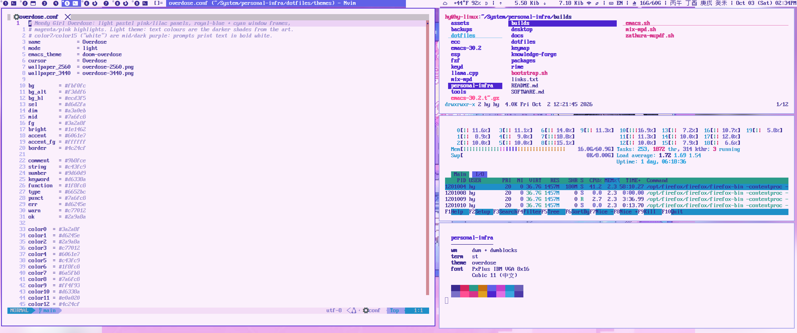
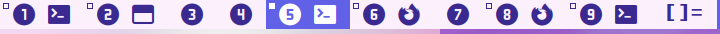
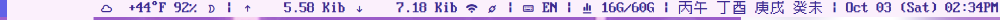

My dwm build: a retro, pixel-font desktop whose colours follow the system-wide =theme= command.
Part of [[https://github.com/AnissL93/personal-infra][personal-infra]] (theme gallery: https://anissl93.github.io/personal-infra/).

* DWM
version: [[https://dwm.suckless.org/][dwm-6.3]], built on Ubuntu (Debian-family) by =bootstrap.sh suckless=.

*Preview* (theme: overdose, ultrawide 3440x1440)

** Look
- *Fonts*: PxPlus IBM VGA 8x16 for Latin text, Cubic 11 for Chinese, Typicons for status-bar icons,
  Symbols Nerd Font for tags, Noto Color Emoji as fallback (colour emoji need libXft >= 2.3.5;
  bootstrap builds a patched one if the system's is older).
- *Colours*: none are hard-coded. =theme NAME= writes =dwm.*= X resources (bar, selected tag,
  borders) and reloads them live with =dwmc xrdb=; dmenu uses the same colours. The values in
  =config.def.h= (amber CRT) are only the fallback.
- *Tags*: circled Nerd Font numbers. After each number comes one icon per app open on that tag,
  matched on =WM_CLASS= (=tagicons= in =config.def.h=): firefox, terminal, emacs, vscode,
  obsidian, zathura, mpv; anything else gets a generic window icon. The selected tag is drawn in
  the theme's bar colour.

  
- *Windows*: 3px borders, 5px vanity gaps, swallowing terminals (an app started from st replaces it).

** Keys
=Super= is the modifier.

| Key                         | Action                                                        |
|-----------------------------+---------------------------------------------------------------|
| =Super-Enter=               | st                                                            |
| =Super-d= / =Super-Shift-d= | dmenu / emoji picker                                          |
| =Super-e=                   | emacs (emacsclient)                                           |
| =Super-Shift-w=             | firefox                                                       |
| =Super-Shift-e=             | emacs-everywhere                                              |
| =Super-Shift-f=             | lf in st                                                      |
| =Super-Shift-p=             | screenshot                                                    |
| =Super-j/k=, =Super-v=      | focus next / previous / master (=Shift=: move the window)     |
| =Super-h/l=, =Super-o=      | master width, number of masters                               |
| =Super-t y u i [ ]=         | layout pairs (=Shift= for the second): tile/bstack, spiral/dwindle, centered master/floating master, monocle/deck, grid/nrowgrid, horizgrid/gaplessgrid |
| =Super-Space=               | cycle layouts                                                 |
| =Super-f= / =Super-m=       | toggle floating / fullscreen                                  |
| =Super-Shift-s=             | sticky (show on every tag)                                    |
| =Super-1..9=, =Super-0=     | view tag, view all (=Shift=: send window; =Ctrl=: toggle)     |
| =Super-, .=                 | focus monitor (=Shift=: send window to monitor)               |
| =Super-Tab=                 | previous tag                                                  |
| =Super-q= / =Super-Ctrl-q=  | close window / quit dwm                                       |
| =Super-Shift-b=             | toggle bar                                                    |
| =Super-Shift-F5=            | reload X resources (colours)                                  |

Media keys: brightness (xbacklight), volume and mute (pulsemixer), play/pause (playerctl).
=dwmc COMMAND [ARG]= runs any of these from a script (e.g. =dwmc viewex 4=, =dwmc xrdb=).

** Patches
- dwm-6.1-single_tagset.diff
- dwm-actualfullscreen-20211013-cb3f58a.diff
- dwm-alpha-20201019-61bb8b2.diff
- dwm-sticky-6.1.diff
- dwm-swallow-20201211-61bb8b2.diff
- dwm-xresources-20210827-138b405.diff
- dwm-vanitygaps-6.2.diff (tile, bstack, bstackhoriz, centeredmaster, centeredfloatingmaster, deck, fibonacci (dwindle, spiral), grid, nrowgrid)
- dwm-statuscmd-status2d-20210405-60bb3df.diff
- dwm-dwmc-6.2.diff
- cyclelayouts
- keepfloatingposition (=keepfloatingposition.c=)
- own: per-client app icons on tags; fix for a fullscreen window stuck after swapping tags across monitors

** Build
#+begin_src sh
rm -f config.h && make && sudo make install     # config.def.h is the source of truth
cd dmenu && rm -f config.h && make && sudo make install
#+end_src
=dwm.desktop= adds a dwm session to display managers; it runs =~/.xinitrc=.

* Dwmblocks
The status bar: each block is a script from =desktop/linux/scripts= (on =$PATH=), with its own
update interval and signal (=dwmblocks/blocks.h=). Icons are Typicons, printed by the scripts.

| Block         | Shows                                         | Every | Click                                     |
|---------------+-----------------------------------------------+-------+-------------------------------------------|
| show_weather  | place, sky, temperature, humidity, moon phase | 16 h  | left: full report, right: refresh         |
| show_network  | upload / download rate, wifi/ethernet, proxy  | 2 s   |                                           |
| input_method  | fcitx5 state: =EN= or =中=                    | 1 s   | left: fcitx5 settings                     |
| show_resource | memory used / total                           | 10 s  | left: htop                                |
| battery       | charge and charging state                     | 6 s   |                                           |
| show_bazi     | 八字: year, month, day and hour pillars       | 1 min |                                           |
| date          | =Oct 03 (Sat) 02:34PM=                        | 2 min |                                           |

Middle-click any block to edit its script.
